# About Smart RGB Ambient Lighting System

## I. Introduction

Smart RGB Ambient Lighting System là một hệ thống chiếu sáng thông minh sử dụng **FPGA PYNQ-Z2**, **cảm biến ánh sáng BH1750**, **cảm biến nhiệt độ LM75**, và **LED RGB WS2812** để tạo ra hiệu ứng ánh sáng tự động theo môi trường.

Dự án này kết hợp **thiết kế phần cứng (RTL – Verilog HDL)** và **giao tiếp I²C** để thu thập dữ liệu môi trường theo thời gian thực, sau đó điều khiển dải LED RGB hiển thị màu sắc/độ sáng tương ứng.

Toàn bộ quá trình xử lý – từ đọc sensor, chuyển đổi dữ liệu, xử lý logic hiệu ứng đến xuất tín hiệu điều khiển WS2812 – đều chạy trên FPGA, giúp hệ thống phản hồi cực nhanh, ổn định và hoạt động độc lập không cần vi xử lý truyền thống. Toàn bộ Logic chạy song song nhờ kiến trúc FPGA → độ trễ cực thấp.

## II. Features

1. **Auto-Brightness**: Độ sáng LED thay đổi theo cường độ ánh sáng môi trường (BH1750).
2. **Thermal Color Effect**: LED tự đổi màu theo nhiệt độ thực tế từ LM75 (cool → warm) phạm vi kiểm tra nhiệt độ từ 25℃ → 35℃.
3. **Multiple RGB Modes**:
   1. Ambient Mode
   2. Rainbow Fade
   3. Wave Effect
   4. Static Color
   5. Chase Mode (ĐÃ LÀM)
   6. Alternate Mode (ĐÃ LÀM)
   7. Blink Mode (ĐÃ LÀM)
4. **Scrolling Warning Text** hiển thị trên LCD1602 (I²C), tự động cảnh báo khi nhiệt độ vượt ngưỡng [25℃, 35℃].
5. **FPGA-based WS2812 Driver**: Tạo chuẩn giao tiếp WS2812 800 kHz hoàn toàn bằng Verilog.

## III. Specification

* **Platform**: TUL PYNQ-Z2 – Xilinx Zynq XC7Z020 FPGA
* **LED Standard**: WS2812B, 800 kHz, 24-bit RGB
* **Sensor Interface**: I²C @ 100 kHz
* **Brightness Resolution**: 16 levels (0 → 15)
* **Temperature Mapping**: –55°C → 125°C (LM75 range)
* **Light Intensity Range**: 1 lx → 65535 lx (BH1750)
* **LCD Output**: 16x2, I²C address 0x27
* **Power**: 5V for LED strip, 3.3V for FPGA + sensors
* **Programming Language**: Verilog HDL
* **Toolchain**: Xilinx Vivado

## IV. Product List

| No  | Name                                           | QTY | Picture                                      |
| --- | ---------------------------------------------- | --- | -------------------------------------------- |
| 1   | TUL PYNQ-Z2 Board XILINX ZYNQ XC7Z020 FPGA     | 1   |      |
| 2   | NEOPixel WS2812 5050 RGB 64 LED 5V DC          | 2   |  |
| 3   | GY-30 BH1750VI Light Intensity Sensor          | 1   |         |
| 4   | CJMCU-75 LM75 Temperature Sensor -55 → +125 °C | 1   |          |
| 5   | MKE-M07 LCD1602 I²C Module                     | 1   |    |

## V. Architecture

Hệ thống thiết kế theo hướng **module hóa** và **xử lý song song**, sử dụng mô hình **Sensor → Processing → Effect → Driver → Output**. Mỗi thành phần đảm nhiệm một nhiệm vụ độc lập, sau đó kết nối với nhau thông qua các bus tín hiệu rõ ràng và chuẩn hóa. Kiến trúc tổng quan gồm 5 khối chính:

### 1. Sensor Interface Layer (I²C Layer)

Tầng này bao gồm các module đọc cảm biến chạy trên bus I²C:

* **BH1750 Reader** : lấy giá trị độ sáng môi trường theo chu kỳ cố định.
* **LM75 Reader** : truy xuất nhiệt độ theo thời gian thực.

Cả hai module đều dùng chung **I²C Master** tùy chỉnh, hỗ trợ truyền–nhận 8-bit, acknowledge, stop/start condition theo chuẩn 100 kHz.

| _Figure 1: I²C Master Module_                                                | _Figure 2: BH1750 Reader Module_                                             | _Figure 3: LM75 Reader Module_                                               |
| ---------------------------------------------------------------------------- | ---------------------------------------------------------------------------- | ---------------------------------------------------------------------------- |
| 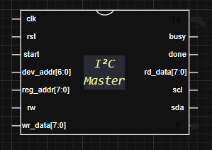 | 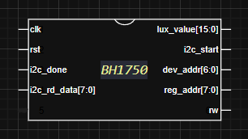 | 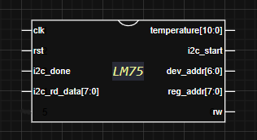 |

### 2. Data Processing Layer

Sau khi dữ liệu được lấy từ cảm biến, tầng xử lý sẽ đảm nhiệm việc:

* Chuyển đổi dữ liệu raw thành giá trị usable.
* **Brightness Controller** : map lux → mức sáng (0–15).
* **Temperature Effect Controller** : map nhiệt độ → màu RGB tương ứng (cool/warm).

| _Figure 4: Brightness Controller Module_                                     | _Figure 5: Temperature Effect Controller_                                    |
| ---------------------------------------------------------------------------- | ---------------------------------------------------------------------------- |
| 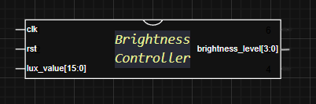 | 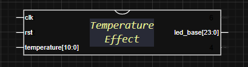 |

> Tầng này là “não” của hệ thống, quyết định logic biểu hiện ánh sáng.

### 3. RGB Effect Engine

Đây là khối tạo hiệu ứng RGB chạy song song:

* Ambient Mode
* Rainbow Fade
* Wave Mode
* Static Color

Khối này nhận input từ tầng xử lý (độ sáng, màu cơ bản, nhiệt độ) và trộn vào hiệu ứng đang chạy → tạo ra **mảng 64 giá trị RGB** cho dải LED WS2812.

_Figure 6: RGB Effect Engine_
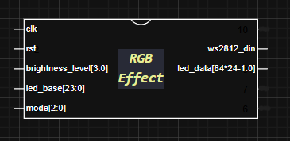

### 4. WS2812 Layer

Module quan trọng nhất để giao tiếp LED, sinh ra chuẩn timing **800 kHz** cho WS2812, gồm:

* Tạo các bitstream 24-bit cho từng LED
* Sinh waveform chính xác từng nanosecond (T0H, T0L, T1H, T1L)
* Gửi tuần tự 64 LED theo pipeline

| _Figure 7.1: WS2812 Chain Module_                                                | _Figure 7.2: WS2812 Driver Module_                                               |
| -------------------------------------------------------------------------------- | -------------------------------------------------------------------------------- |
| 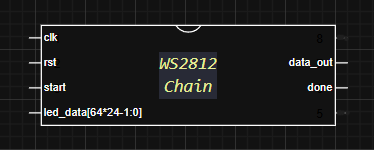 | 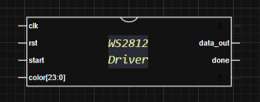 |

### 5. Display & UI Layer

* **LCD1602 Text Scroller** hiển thị trạng thái hệ thống, brightness hiện tại và cảnh báo khi nhiệt độ vượt ngưỡng.
* Text scrolling được làm bằng frame buffer nhỏ để mô phỏng chuyển động mượt.

_Figure 8: LCD 1602 Display Module_
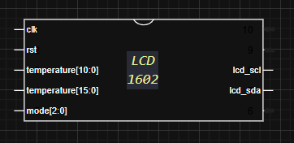

### Top-Level Integration

Tất cả module được đóng gói trong  **top.v** , nơi:

* Clock được chia và xử lý
* Reset logic quản lý trạng thái hệ thống
* Các module được nối với nhau theo kiến trúc pipeline
* Sensor → Processing → Effect → Driver chạy song song

_Figure 9: Top-Level Integration Module_
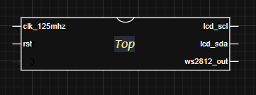

## VI. Block Diagram / Data Flow

### 1. Block Diagram Overview

Hệ thống Smart RGB Ambient Lighting System được chia thành 5 khối chính, kết nối theo pipeline **BH1750 & LM75 → I²C Interface → Processing → RGB Engine → WS2812 Driver → LED Strip**.
Sơ đồ khối tổng quan mô tả luồng dữ liệu vận hành real-time:

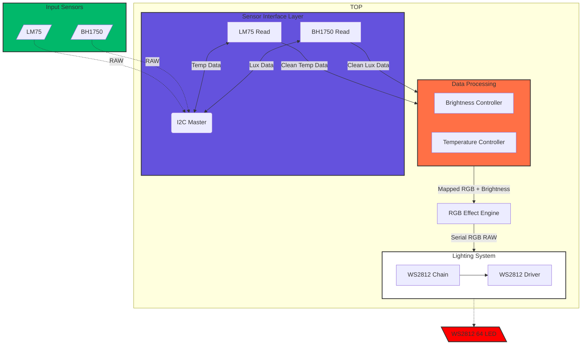
```mermaid
flowchart TB
    subgraph SENSORS [Input Sensors]
        BH1750@{ shape: lean-r, label: "BH1750" }
        LM75@{ shape: lean-r, label: "LM75" }
    end

    subgraph TOP
        subgraph I2C_IF [Sensor Interface Layer]
            1["BH1750 Read"]; 2["LM75 Read"];
            I2C_MASTER(I2C Master)
        end

        subgraph PROC [Data Processing]
            4[Brightness Controller]; 5[Temperature Controller];
        end

        EFFECT["RGB Effect Engine"];
        subgraph WS2812_SYS [Lighting System]
            LED_CHAIN[WS2812 Chain];
            WS2812_DRV["WS2812 Driver"];
        end
  
        1<--Lux Data-->I2C_MASTER;
        2<--Temp Data-->I2C_MASTER;
        %% Connections from sensors to I2C interface
        BH1750 & LM75-.RAW.->I2C_MASTER;
        1--Clean Lux Data-->PROC;
        2--Clean Temp Data-->PROC;

        LED_CHAIN-->WS2812_DRV;
        PROC--Mapped RGB + Brightness-->EFFECT--Serial RGB RAW-->WS2812_SYS;
    end

    WS2812@{ shape: lean-l, label: "WS2812 64 LED" };
    WS2812_SYS-.->WS2812;

    %% ===== STYLES =====
    style SENSORS fill:#01b86a,stroke:#333,stroke-width:2px
    style I2C_IF fill:#6452dd,stroke:#333,stroke-width:2px
    style PROC fill:#ff7046,stroke:#333,stroke-width:2px
    style WS2812_SYS fill:#FFF,stroke:#333,stroke-width:2px
    style WS2812 fill:#f00,stroke:#333,stroke-width:2px
```

### 2. LM75 I²C Read Temperature Flow

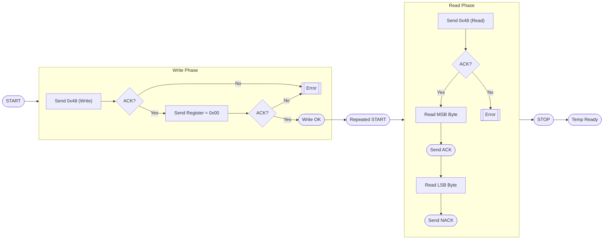
```mermaid
flowchart LR
    START([START]) --> WRITE_PHASE

    %% --- WRITE PHASE ---
    subgraph WRITE_PHASE [Write Phase]
        direction TB
        AW["Send 0x48 (Write)"] --> ACK1{ACK?}
        ACK1 -->|Yes| REG["Send Register = 0x00"]
        ACK1 -->|No| ERR1[[Error]]

        REG --> ACK2{ACK?}
        ACK2 -->|Yes| DONE_W([Write OK])
        ACK2 -->|No| ERR1[[Error]]
    end

    DONE_W --> RS([Repeated START])

    %% --- READ PHASE ---
    subgraph READ_PHASE [Read Phase]
        direction TB
        AR["Send 0x48 (Read)"] --> ACK3{ACK?}
        ACK3 -->|Yes| MSB["Read MSB Byte"]
        ACK3 -->|No| ERR2[[Error]]

        MSB --> ACK_MSB([Send ACK])
        ACK_MSB --> LSB["Read LSB Byte"]

        LSB --> NACK_LSB([Send NACK])
    end

    RS --> READ_PHASE --> STOP([STOP])
    STOP --> DONE([Temp Ready])

```

#### LM75 I²C Write Temperature on LCD I²C

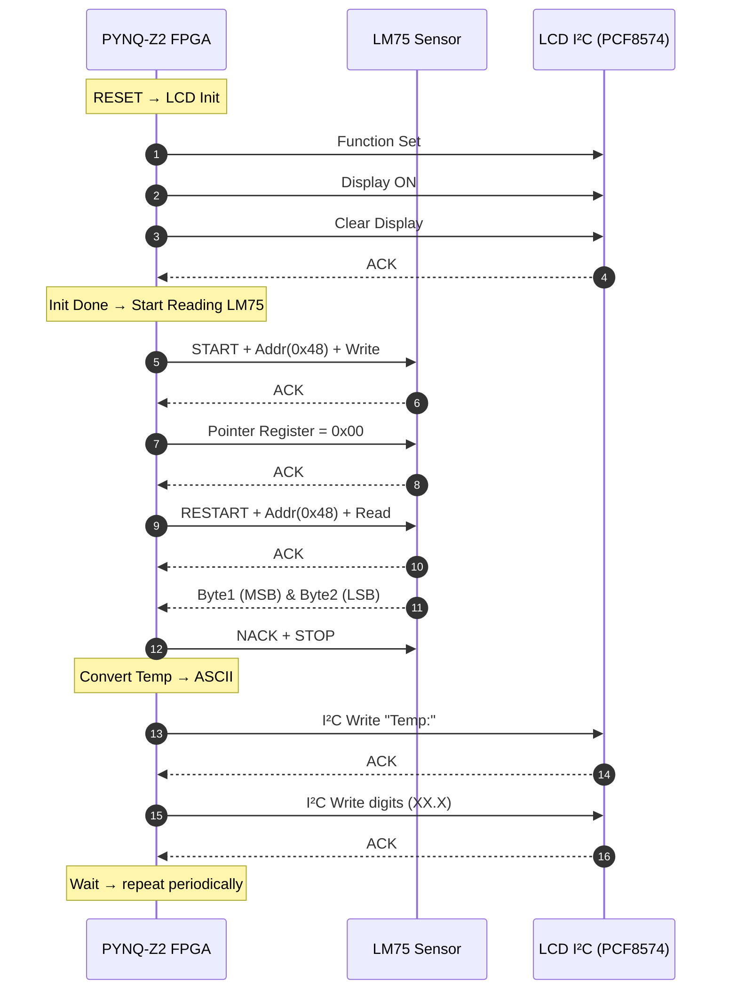
```mermaid
sequenceDiagram
    autonumber

    participant FPGA as PYNQ-Z2 FPGA
    participant LM75 as LM75 Sensor
    participant LCD as LCD I²C (PCF8574)

    Note over FPGA: RESET → LCD Init

    FPGA->>LCD: Function Set
    FPGA->>LCD: Display ON
    FPGA->>LCD: Clear Display
    LCD-->>FPGA: ACK

    Note over FPGA: Init Done → Start Reading LM75

    FPGA->>LM75: START + Addr(0x48) + Write
    LM75-->>FPGA: ACK

    FPGA->>LM75: Pointer Register = 0x00
    LM75-->>FPGA: ACK

    FPGA->>LM75: RESTART + Addr(0x48) + Read
    LM75-->>FPGA: ACK

    LM75-->>FPGA: Byte1 (MSB) & Byte2 (LSB)
    FPGA->>LM75: NACK + STOP

    Note over FPGA: Convert Temp → ASCII

    FPGA->>LCD: I²C Write "Temp:"
    LCD-->>FPGA: ACK

    FPGA->>LCD: I²C Write digits (XX.X)
    LCD-->>FPGA: ACK

    Note over FPGA: Wait → repeat periodically
```

### 3. BH1750 I²C Read Lux Flow

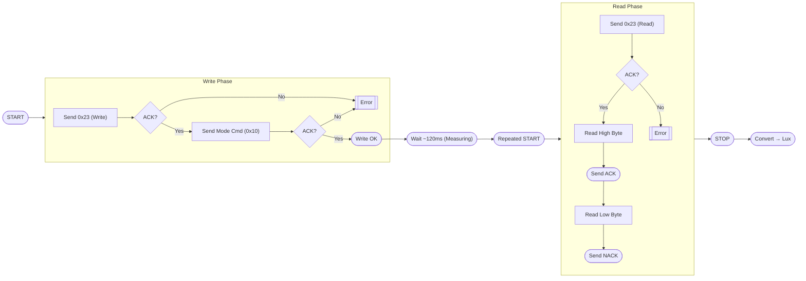
```mermaid
flowchart LR

    START([START]) --> WRITE_FLOW

    %% --- WRITE PHASE ---
    subgraph WRITE_FLOW [Write Phase]
        direction TB
        AW["Send 0x23 (Write)"] --> ACK1{ACK?}
        ACK1 -->|Yes| CMD["Send Mode Cmd (0x10)"]
        ACK1 -->|No| ERR1[[Error]]

        CMD --> ACK2{ACK?}
        ACK2 -->|Yes| DONE_W([Write OK])
        ACK2 -->|No| ERR1[[Error]]
    end

    DONE_W --> WAIT(["Wait ~120ms (Measuring)"])
    WAIT --> RS([Repeated START])

    %% --- READ PHASE ---
    subgraph READ_FLOW [Read Phase]
        direction TB
        AR["Send 0x23 (Read)"] --> ACK3{ACK?}
        ACK3 -->|Yes| HB["Read High Byte"]
        ACK3 -->|No| ERR3[[Error]]

        HB --> ACK_H([Send ACK])
        ACK_H --> LB["Read Low Byte"]

        LB --> NACK_L([Send NACK])
    end

    RS --> READ_FLOW --> STOP([STOP])
    STOP --> CALC([Convert → Lux])

```

### 4. I²C Bus Topology (1 SDA + 1 SCL)

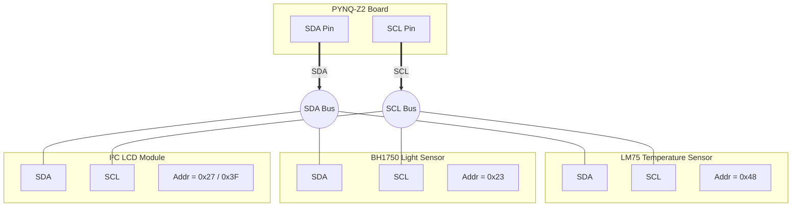
```mermaid
flowchart TB
    subgraph PYNQ_Z2 [PYNQ-Z2 Board]
        direction TB
        SDA_P[SDA Pin]
        SCL_P[SCL Pin]
    end

    SDA_P == SDA ==> SDA_BUS((SDA Bus))
    SCL_P == SCL ==> SCL_BUS((SCL Bus))

    %% --- SLAVES ---
    subgraph LM75 [LM75 Temperature Sensor]
        SDA1[SDA]
        SCL1[SCL]
        ADDR1[Addr = 0x48]
    end

    subgraph BH1750 [BH1750 Light Sensor]
        SDA2[SDA]
        SCL2[SCL]
        ADDR2[Addr = 0x23]
    end

    subgraph LCD [I²C LCD Module]
        SDA3[SDA]
        SCL3[SCL]
        ADDR3[Addr = 0x27 / 0x3F]
    end

    %% --- BUS CONNECTIONS ---
    SDA_BUS --- SDA1
    SDA_BUS --- SDA2
    SDA_BUS --- SDA3

    SCL_BUS --- SCL1
    SCL_BUS --- SCL2
    SCL_BUS --- SCL3
```

#### 📝 Giải thích chi tiết

* **Chỉ 1 SDA + 1 SCL** từ PYNQ-Z2
* Tạo thành **I²C shared bus**
* 3 module (LM75, BH1750, LCD) **cùng nối song song** lên SDA/SCL
* Master nhận biết từng module bằng  **I²C Address** :
  * LM75 → `0x48`
  * BH1750 → `0x23`
  * LCD → `0x27` hoặc `0x3F`
* Pull-up 4.7kΩ có thể đã nằm sẵn trong module LCD (hầu hết LCD I²C đều có)
* Các module nên chạy ở **cùng speed** (100kHz Standard mode là safe)

## VII. Use-Case

Smart RGB Ambient Lighting System hướng đến những tình huống thực tế cần  **ánh sáng thông minh** ,  **phản hồi theo môi trường** , và  **tăng trải nghiệm người dùng** . Dưới đây là các use-case chính:

### 1. Tự động điều chỉnh ánh sáng theo môi trường (Auto Ambient Light)

**Use-case:** Phòng quá tối hoặc quá sáng.

**Hệ thống làm gì:**

* BH1750 đo cường độ ánh sáng nền.
* Brightness Controller tự tính mức sáng LED phù hợp.
* LED WS2812 tăng/giảm độ sáng real-time.

**Lợi ích:**

* Ánh sáng luôn dễ chịu.
* Tránh chói mắt khi trời tối hoặc bị mờ khi trời sáng.

### 2. Cảnh báo nhiệt độ theo thời gian thực (Temperature Warning)

**Use-case:** Nhiệt độ phòng tăng cao hoặc vượt ngưỡng an toàn (ví dụ > 35°C).

**Hệ thống làm gì:**

* LM75 đọc nhiệt độ liên tục.
* RGB Effect Engine đổi màu LED sang **đỏ** để báo hiệu.
* LCD1602 hiển thị warning bằng hiệu ứng  _scrolling text_ .

**Lợi ích:**

* Dễ dàng nhận biết rủi ro về nhiệt độ.
* Thích hợp cho phòng server mini, tủ máy, khu vực lab.

### 3. Mood Lighting / Decor Lighting

**Use-case:** Chill room, phòng ngủ, gaming setup, studio quay video.

**Hệ thống làm gì:**

* Chạy các hiệu ứng RGB như Rainbow, Fade, Wave.
* Tự điều chỉnh màu nền theo ánh sáng thực.

**Lợi ích:**

* Không gian trở nên sống động, aesthetic hơn.
* Tạo vibe chill/relax/gaming đúng mood.

### 4. Dashboard Mini-Display (Thông tin thu nhỏ)

**Use-case:** Người dùng muốn xem nhanh thông tin phòng.

**Hệ thống làm gì:**

* LCD1602 hiển thị nhiệt độ, độ sáng, chế độ LED hiện tại.
* Scrolling text dùng để hiển thị thông tin dài.

**Lợi ích:**

* Dễ quan sát trạng thái.
* UI trực quan, không cần app.

## VIII. Result & Evaluation

Sau khi hoàn thiện và kiểm thử từng module, hệ thống Smart RGB Ambient Lighting System hoạt động ổn định và đạt được các kết quả sau:

* [ ] **Sensor hoạt động chính xác**
  * [ ] BH1750 đọc cường độ ánh sáng
  * [ ] LM75 đo nhiệt độ chính xác
  * [ ] Giao tiếp I²C chạy ổn định
* [ ] **Xử lý dữ liệu real-time, độ trễ thấp**
  * [ ] Pipeline Sensor → Processing → Effect → LED phản hồi tức thời
  * [ ] Thay đổi ánh sáng/nhiệt độ được LED cập nhật ngay lập tức
* [ ] **Hiệu ứng RGB hoạt động mượt**
  * [ ] Các mode Rainbow, Ambient, Wave, Static Color hoạt động đúng logic thiết kế
  * [ ] Không xuất hiện nhấp nháy (flicker), giật khung hoặc hiện tượng trễ frame
  * [ ] Màu sắc đồng đều và đúng với giá trị RGB được tính toán
* [X] **WS2812 Driver đạt chuẩn timing**
  * [X] Tín hiệu 800 kHz ổn định, biên độ và duty an toàn từ datasheet WS2812B
  * [X] LED nhận đủ 24-bit per pixel, hiển thị chính xác toàn bộ 64 LED
* [ ] **LCD1602 hiển thị tốt**
  * [ ] Text scrolling hoạt động mượt, không bị xé chữ
  * [ ] Hiển thị đầy đủ thông tin:
    * [ ] Nhiệt độ
    * [ ] Độ sáng
    * [ ] Mode LED
    * [ ] Cảnh báo nhiệt độ cao
* [ ] **Độ chính xác thích ứng môi trường**
  * [ ] Brightness cho ra độ sáng LED rất tự nhiên
  * [ ] Color Effect phản ánh đúng trạng thái môi trường

## IX. Conclusion

Smart RGB Ambient Lighting System đã chứng minh được khả năng kết hợp hiệu quả giữa cảm biến môi trường, xử lý tín hiệu, và hiển thị ánh sáng thông minh trên nền tảng FPGA. Thông qua kiến trúc module hóa rõ ràng và pipeline xử lý song song, hệ thống hoạt động ổn định, phản hồi nhanh và hiển thị hiệu ứng sống động theo thời gian thực.

## X. References

> Các tài liệu tham khảo được chọn lọc từ datasheet chính thức, tài nguyên học thuật, và nguồn kỹ thuật uy tín.

### Datasheets & Hardware Manuals

1. [BH1750 Ambient Light Sensor Datasheet](https://www.mouser.com/datasheet/2/348/bh1750fvi-e-186247.pdf?srsltid=AfmBOorQoPjslmh4sgjDp35GZIt1oeS7Q-DngYl_5kiTnMGGyr--5XnB) — ROHM Semiconductor
2. [LM75 Digital Temperature Sensor Datasheet](https://www.nxp.com/docs/en/data-sheet/LM75A.pdf) — NXP Semiconductors
3. [WS2812 Intelligent Control RGB LED Datasheet](https://cdn.sparkfun.com/assets/e/6/1/f/4/WS2812B-LED-datasheet.pdf) — WorldSemi
4. [PYNQ-Z2 Hardware User Guide](https://www.mouser.com/datasheet/2/744/pynqz2_user_manual_v1_0-1525725.pdf?srsltid=AfmBOorEV26vWK8u0g5OE3bNDgZQ5KY5zzM6rgBr5uBkP4irQWiiZpY5) — TUL Corporation
5. [Xilinx Zynq-7000 SoC Technical Reference Manual (UG585)](https://class.ece.iastate.edu/cpre488/resources/ug585-Zynq-7000-TRM.pdf)
6. [Understanding the I2C Bus (SLVA704)](https://www.ti.com/lit/an/slva704/slva704.pdf) - Texas Instruments
7. [I2C Bus Pullup Resistor Calculation (SLVA689)](https://www.ti.com/lit/an/slva689/slva689.pdf?ts=1763907618869) - Texas Instruments
8. [A Basic Guide to I2C (SBAA565)](https://www.ti.com/lit/an/sbaa565/sbaa565.pdf?ts=1762997849293) - Texas Instruments
9. [PCF8574 Remote 8-Bit I/O Expander for I2C Bus](https://www.ti.com/lit/ds/symlink/pcf8574.pdf) - Texas Instruments

### FPGA & Verilog References

10. _FPGA Prototyping by Verilog Examples_ — Pong P. Chu
11. _Digital Design and Computer Architecture_ — Harris & Harris

### Communication Protocols

12. [I²C Bus Specification and User Manual (UM10204)](https://www.nxp.com/docs/en/user-guide/UM10204.pdf) — NXP Semiconductors
