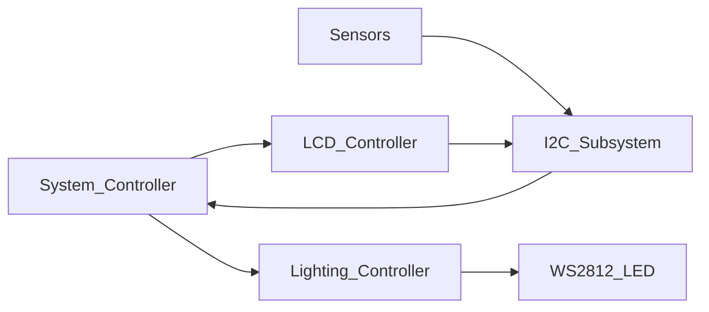

# 🌈 **Smart RGB Ambient Lighting System**

### **FPGA-Based Adaptive Lighting Using I2C Sensors + WS2812 LEDs + LCD Display**

---

## 📌 **Giới thiệu**

Smart RGB Ambient Lighting System là một hệ thống ánh sáng thông minh chạy trên FPGA, tự điều chỉnh màu sắc và độ sáng dựa trên môi trường thực tế.
Hệ thống tích hợp:

* **BH1750** – cảm biến cường độ sáng (Lux)
* **LM75** – cảm biến nhiệt độ
* **WS2812** – dải LED RGB địa chỉ hóa
* **LCD 16x2 (PCF8574 I²C)** – hiển thị thông tin
* **I²C Master + Arbiter** – cho phép 3 thiết bị I²C hoạt động song song
* **System Logic** – đưa ra quyết định về ánh sáng và UI

Project được tách thành nhiều module rõ ràng, có tính module hóa cao, dễ dàng mở rộng hoặc thay đổi phần cứng.

---

## 🏗️ **Kiến trúc tổng thể**



Toàn bộ hệ thống tuân theo kiến trúc 4-layer:

### **1) I2C Subsystem**

Gồm:

* `i2c_master`
* `i2c_arbiter`
* `bh1750_client`
* `lm75_client`
* `lcd_i2c_manager` (gồm `lcd_controller` + `lcd_byte_send`)

Nhiệm vụ:

* Đọc dữ liệu từ BH1750, LM75
* Gửi lệnh cho LCD qua PCF8574
* Quản lý chia bus I²C giữa 3 client

### **2) System Controller**

* Nhận dữ liệu sensor (`lux_value`, `temp_value`)
* Sinh logic điều khiển ánh sáng:

  * `brightness_level` (0–255)
  * `base_rgb` (24 bit)
* Tạo nội dung hiển thị LCD:

  * `line1_text`
  * `line2_text`
* Gửi yêu cầu cập nhật LCD: `lcd_update_req`

### **3) Lighting Controller**

* Nhận `brightness_level` + `base_rgb`
* Sinh dữ liệu LED `led_data`
* Kích hoạt truyền LED `ws_start`

### **4) WS2812 Chain**

* Tạo tín hiệu thời gian chính xác của WS2812
* Xuất dữ liệu ra dải LED: `ws2812_dout`

---

## 🖼️ **Sơ đồ tổng quan**


---

## 📂 **Cấu trúc thư mục gợi ý**

```
rtl/
│
├── i2c/
│   ├── i2c_master.v
│   ├── i2c_arbiter.v
│   ├── bh1750_client.v
│   ├── lm75_client.v
│   └── lcd_i2c_manager.v
│
├── lcd/
│   ├── lcd_controller.v
│   └── lcd_byte_send.v
│
├── led/
│   ├── lighting_controller.v
│   └── ws2812_chain.v
│
├── system/
│   └── system_controller.v
│
└── top.v
```

---

## ⚙️ **Luồng hoạt động chi tiết**

### **1) Sensor → I2C subsystem**

* `bh1750_client` đọc 2 byte lux
* `lm75_client` đọc 2 byte nhiệt độ
* `i2c_arbiter` đảm bảo không tranh chấp bus

### **2) I2C subsystem → System Controller**

* Cập nhật `lux_value`, `lux_valid`
* Cập nhật `temp_value`, `temp_valid`

### **3) System Controller → Lighting Controller**

Sinh ra:

* `brightness_level`: dựa trên độ sáng môi trường
* `base_rgb`: dựa trên nhiệt độ hoặc logic nghệ thuật

### **4) Lighting Controller → WS2812**

* Tạo pattern LED
* Xuất `led_data` + `ws_start`

### **5) System Controller → LCD**

* Tạo nội dung 2 dòng text
* Gửi yêu cầu update LCD
* `lcd_i2c_manager` viết text qua PCF8574

---

## 🧪 **Testing & Simulation**

Bạn có thể viết testbench riêng cho:

* `i2c_master_tb.v`
* `i2c_arbiter_tb.v`
* `bh1750_client_tb.v`
* `lm75_client_tb.v`
* `lcd_controller_tb.v`
* `lighting_controller_tb.v`
* `ws2812_chain_tb.v`
* `top_tb.v`

Khuyên dùng:

* **ModelSim / QuestaSim**
* **GTKWave**
* **Xilinx Vivado / Intel Quartus Waveform Simulation**

---

## 🧩 **Điểm mạnh của kiến trúc**

* ⭐ **Modular hóa hoàn toàn** → Dễ bảo trì, dễ mở rộng
* ⭐ **Tương thích nhiều cảm biến khác nhau**
* ⭐ **I2C arbiter chuẩn công nghiệp**
* ⭐ **Phân lớp rõ ràng** giữa logic hệ thống, logic hiển thị LED và giao tiếp phần cứng
* ⭐ **Có thể thay LCD bằng OLED hoặc UART mà không cần thay đổi hệ thống chính**
* ⭐ **Có thể mở rộng thêm cảm biến (BME280, SHT31…) chỉ bằng cách thêm 1 client**

---

## 📜 **Giấy phép**

Bạn có thể chọn MIT / Apache 2.0 / BSD tuỳ ý.
Ví dụ:

```
This project is licensed under the MIT License.
```

---

## 🤝 **Đóng góp**

Pull requests được hoan nghênh!
Bạn có thể mở issue nếu cần hỗ trợ thêm.

---

## 📧 **Liên hệ**

Nếu bạn muốn mình tạo tài liệu PDF, block-diagram chuyên nghiệp, hoặc viết mô tả từng module cho đồ án, chỉ cần yêu cầu.

---

# 🎉 **Dự án đã hoàn chỉnh kiến trúc — Bạn đã sẵn sàng để implement!**

Bạn muốn mình hỗ trợ bước tiếp theo không?
👉 Viết FSM BH1750?
👉 Viết arbiter?
👉 Viết lighting pattern?
