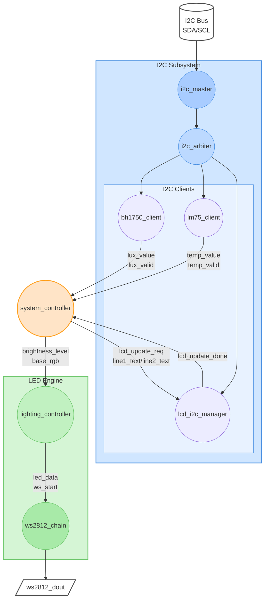

# 🌈 Smart RGB Ambient Lighting System

Mình viết kiến trúc tổng thể (architecture) cho **Smart RGB Ambient Lighting System** theo kiểu “từ trên xuống”, gắn luôn với các khối RTL bạn đang có nhé.



🔌 **Luồng chạy chính:**

* Sensor → System Controller → LED Controller → WS2812 → LED Strip
* System Controller ↔ LCD Manager ↔ I2C Bus
* Các I2C client độc lập → I2C arbiter → I2C master → Bus

---

## 1. Mục tiêu hệ thống

**Smart RGB Ambient Lighting System** là một hệ thống chiếu sáng môi trường dùng dải LED **WS2812** (RGB), điều chỉnh màu sắc/độ sáng **tự động** dựa trên:

* **Độ sáng môi trường** (cảm biến ánh sáng **BH1750** – I2C).
* **Nhiệt độ môi trường** (cảm biến nhiệt độ **LM75** – I2C).

Đồng thời:

* **Hiển thị giá trị đo được / trạng thái** lên màn hình **LCD 16x2 qua PCF8574 (I2C)**.
* Tất cả chạy trên **FPGA**, clock hệ thống **125 MHz** (ví dụ Artix-7 / Cyclone…).

---

## 2. Kiến trúc mức cao (High-level Architecture)

Có thể hình dung hệ thống thành 4 lớp chính:

1. **Lớp ngoại vi (Physical/Peripheral Layer)**

   * Cảm biến BH1750 (I2C)
   * Cảm biến LM75 (I2C)
   * LCD 16x2 + PCF8574 (I2C)
   * Dải LED WS2812
2. **Lớp giao tiếp bus (I2C & LED Serial Bus)**

   * **i2c_master** + logic điều khiển truy xuất từng slave (BH1750, LM75, PCF8574)
   * Chuẩn thời gian bit-stream **WS2812** (T0H/T1H/T0L/T1L, reset)
3. **Lớp xử lý & điều khiển (Control & Processing Layer)**

   * Các module **bh1750_reader**, **lm75_reader**
   * Module **color_mapping** / **lighting_controller**: chuyển giá trị lux, °C sang màu/độ sáng LED
   * FSM điều khiển luồng: đọc sensor → xử lý → cập nhật LED → cập nhật LCD.
4. **Lớp tích hợp hệ thống (Top-level Integration)**

   * Module **top.v** nối tất cả: clock, reset, i2c_master, sensor reader, LCD controller, ws2812 controller.

---

## 3. Lớp ngoại vi

### 3.1. Cảm biến ánh sáng BH1750 (I2C)

* Địa chỉ I2C 7-bit: **0x23** hoặc **0x5C** (tuỳ module).
* Được kết nối:

  * **SCL** ↔ `i2c_scl` (FPGA output open-drain)
  * **SDA** ↔ `i2c_sda` (FPGA inout open-drain)
* Được module **bh1750_reader** truy xuất thông qua **i2c_master**:

  * Gửi lệnh đo (Continuous H-Resolution Mode)
  * Đọc dữ liệu 2 byte → tính ra **lux_value** (hoặc giữ raw cho đơn giản).

### 3.2. Cảm biến nhiệt độ LM75 (I2C)

* Địa chỉ 7-bit: **0x48 – 0x4F** (tuỳ chân A0, A1, A2).
* Cũng dùng chung đường **SCL/SDA** với BH1750 và LCD.
* Module **lm75_reader**:

  * Gửi read đến register temp
  * Nhận 2 byte → xuất ra **temp_value** (°C hoặc raw).

### 3.3. LCD 16x2 + PCF8574 (I2C)

* PCF8574 là I/O expander chuyển I2C → bus 4-bit của LCD.
* Bit mapping (ví dụ thường gặp):

  ```text
  P7: D7
  P6: D6
  P5: D5
  P4: D4
  P3: BL (backlight)
  P2: E
  P1: RW (0 = write)
  P0: RS (0 = command, 1 = data)
  ```

* PCF8574 cũng là một **I2C slave** (thường 0x27 hoặc 0x3F).
* Module **lcd_controller** (và **lcd_byte_send**) sẽ tạo ra chuỗi byte gửi tới PCF8574 thông qua **i2c_master**, để:

  * Init LCD (4-bit mode, display on, clear, entry mode…)
  * Ghi text (lux, temp, trạng thái) lên 2 dòng.

### 3.4. Dải LED WS2812

* LED nối nối tiếp: `ws2812_dout` từ FPGA → DIN LED1 → DO1 → DIN2 → …
* Hệ thống chỉ cần **một chân** digital: `ws2812_dout`.
* Module RTL:

  * **ws2812_driver**: tạo wave cho **1 LED** (24 bit)
  * **ws2812_chain**: lặp driver để gửi cho **NUM_LEDS** LED.

---

## 4. Lớp giao tiếp bus

### 4.1. I2C Master Core

* Module: **i2c_master.v**
* Chức năng:

  * Tạo tín hiệu SCL theo tần số **I2C_FREQ_HZ** (ví dụ 100 kHz) từ clock 125 MHz.
  * Điều khiển SDA open-drain (tri-state), tạo START, STOP, ACK/NACK.
* Các port chính:

  * `clk`, `rst`
  * `start`, `rw`, `dev_addr`, `reg_addr` (tuỳ thiết kế), `tx_data`, `rx_data`, `busy`, `ack_error`
  * `i2c_scl` (output), `i2c_sda` (inout)

### 4.2. I2C Master Controller (Arbiter/Sequencer)

* Module: **i2c_master_controller.v** (hoặc logic FSM trong `top`).
* Nhiệm vụ:

  * Lập lịch các **transaction I2C** cho từng thiết bị:

    * Bước 1: đọc BH1750
    * Bước 2: đọc LM75
    * Bước 3: ghi dữ liệu LCD (PCF8574)
  * Đảm bảo không có 2 module cùng lúc giật `start` của `i2c_master`.
* Bạn có thể:

  * Hoặc cho từng module reader (bh1750_reader, lm75_reader, lcd_controller) trực tiếp điều khiển i2c_master qua một **multiplexer**.
  * Hoặc làm một **FSM trung tâm** gọi tuần tự:

    * state READ_BH1750 → READ_LM75 → UPDATE_LCD → IDLE → lặp.

---

## 5. Lớp xử lý & điều khiển

### 5.1. Sensor Reader Modules

1. **bh1750_reader.v**

   * FSM nội bộ: `IDLE → START_MEASURE → WAIT → READ_DATA → DONE`.
   * Giao tiếp với i2c_master qua:

     * `m_start`, `m_rw`, `m_dev_addr`, `m_tx_data`, `m_rx_data`, `m_busy`, `m_ack_error`.
   * Output:

     * `lux_value` (N-bit, ví dụ 16 bit)
     * `lux_valid` (1 bit, báo có dữ liệu mới).
2. **lm75_reader.v**

   * Tương tự, nhưng lệnh và cách đọc data theo protocol LM75.
   * Output:

     * `temp_value` (N-bit, ví dụ 16 bit hoặc 12 bit sign-extended)
     * `temp_valid`.

### 5.2. Lighting / Color Mapping Controller

* Module: **color_mapping.v** hoặc **lighting_controller.v**.
* Input:

  * `lux_value`, `lux_valid`
  * `temp_value`, `temp_valid`
  * Có thể thêm tham số cấu hình (ngưỡng sáng, ngưỡng nhiệt độ…)
* Xử lý:

  * Ví dụ:

    * Nếu môi trường **tối** (lux thấp) → tăng **brightness LED**.
    * Nếu **nhiệt độ cao** → chuyển màu LED sang **xanh mát**;
      nhiệt độ thấp → màu **ấm** (cam/đỏ).
  * Tạo ra bộ **màu sắc cho từng LED** hoặc mẫu màu gradient.
* Output:

  * `led_data[NUM_LEDS*24-1:0]`
  * `ws_start` (báo ws2812_chain bắt đầu shift dữ liệu mới)
  * Có thể thêm: `mode`, `effect` nếu bạn muốn hiệu ứng.

### 5.3. System Control FSM

* Có thể nằm luôn trong **top.v** hoặc module riêng **system_controller.v**.
* Chu trình hoạt động (ví dụ):

  1. `INIT`: chờ reset xong, khởi tạo LCD.
  2. `READ_SENSORS`:

     * Gọi `bh1750_reader` → đợi `lux_valid`.
     * Gọi `lm75_reader` → đợi `temp_valid`.
  3. `UPDATE_LED`:

     * Đưa `lux_value`, `temp_value` vào `color_mapping`.
     * Khi `led_data` sẵn sàng → phát `ws_start` cho `ws2812_chain`.
  4. `UPDATE_LCD`:

     * Format text (ví dụ: “Lux: xxxx”, “Temp: yy.yyC”).
     * Gửi từng byte ký tự cho `lcd_controller` → i2c_master → PCF8574 → LCD.
  5. `WAIT_INTERVAL`:

     * Đợi một khoảng thời gian (ví dụ 200 ms, 500 ms) rồi lặp lại `READ_SENSORS`.

---

## 6. Lớp điều khiển LED WS2812

### 6.1. ws2812_driver.v (một LED)

* Input:

  * `clk` (125 MHz)
  * `rst`
  * `start`
  * `color[23:0]` (GRB hoặc RGB tuỳ định nghĩa)
* FSM nội bộ:

  * Duyệt 24 bit, với mỗi bit tạo:

    * `T0H/T0L` nếu bit = 0
    * `T1H/T1L` nếu bit = 1
  * Sau 24 bit → “reset time” ≥ 50 µs (tín hiệu low dài).
* Output:

  * `data_out` (bit tới WS2812)
  * `done` (xong 1 LED).

### 6.2. ws2812_chain.v (nhiều LED)

* Parameter: `NUM_LEDS`.
* Input:

  * `clk`, `rst`
  * `start`
  * `led_data[NUM_LEDS*24-1:0]` (mảng màu).
* FSM:

  * Lặp qua từng LED:

    * Lấy `color_i` (24 bit) → đưa vào `ws2812_driver` → chờ `done`.
  * Sau khi tất cả LED xong → giữ `data_out` low một thời gian reset.
* Output:

  * `data_out` → `ws2812_dout` (pin đi ra dải LED)
  * `done` (xong nguyên chuỗi).

---

## 7. Lớp hiển thị LCD I2C

### 7.1. lcd_controller.v

* Input:

  * `clk`, `rst`
  * Giao tiếp với **lcd_byte_send** (hoặc trực tiếp với `i2c_master`).
  * Interface kiểu:

    * `send_cmd`, `send_data`, `lcd_byte`, `busy`, `done`.
* Chức năng:

  * Chuỗi **init** LCD:

    * Function set, display on, clear, entry mode, home…
  * Viết text:

    * Quản lý con trỏ DDRAM, dòng 1/2, clear line, v.v.
* Output:

  * Các tín hiệu điều khiển tới `lcd_byte_send` → `i2c_master` → PCF8574.

### 7.2. lcd_byte_send.v / i2c_master_write.v

* Đảm nhiệm việc:

  * Tách 1 byte LCD (cmd/data) thành **2 nửa nibble (high/low)** theo chuẩn 4-bit.
  * Với mỗi nibble:

    * Gửi qua PCF8574 kèm RS, E, BL, RW=0.
    * Tạo xung E high rồi low.
  * Tất cả thông qua i2c_master (viết 1 byte tới PCF8574 nhiều lần).

---

## 8. Top-level Integration (top.v)

Cuối cùng, **module top** sẽ:

* **Ports** (ví dụ):

  ```verilog
  module top (
      input  wire clk,        // 125 MHz
      input  wire rst,        // active high / low tuỳ bạn

      inout  wire i2c_sda,
      output wire i2c_scl,

      output wire ws2812_dout
  );
  ```

* Bên trong:

  1. Instantiate **i2c_master** và nối trực tiếp với `i2c_sda`, `i2c_scl`.
  2. Instantiate:

     * `bh1750_reader`
     * `lm75_reader`
     * `lcd_controller` (+ lcd_byte_send nếu tách riêng)
     * `ws2812_chain` (+ ws2812_driver bên trong)
     * `lighting_controller` .
  3. Một FSM trung tâm:

     * Điều phối truy cập i2c_master (multiplex các request).
     * Điều khiển chu trình: đọc sensors → update LED → update LCD.

Bạn có thể coi **architecture** chính là bức tranh này:

* **Một I2C master** duy nhất → phục vụ **3 slave**: BH1750, LM75, PCF8574/LCD.
* **Hai sensor** → giá trị đưa vào **khối mapping** → tạo dữ liệu màu cho **dải WS2812**.
* Đồng thời, các giá trị đó được **format text → LCD** qua cùng bus I2C.
* Tất cả trái tim điều khiển nằm trong **System Controller FSM** ở `top.v`.
